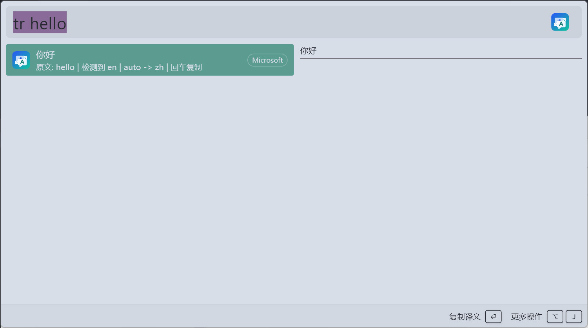
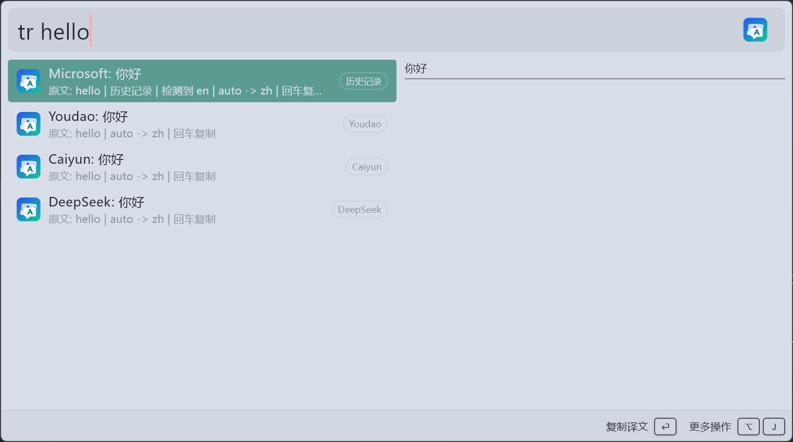
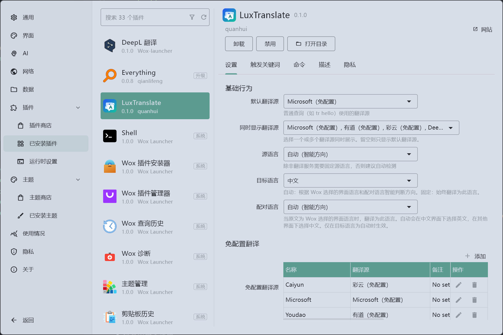
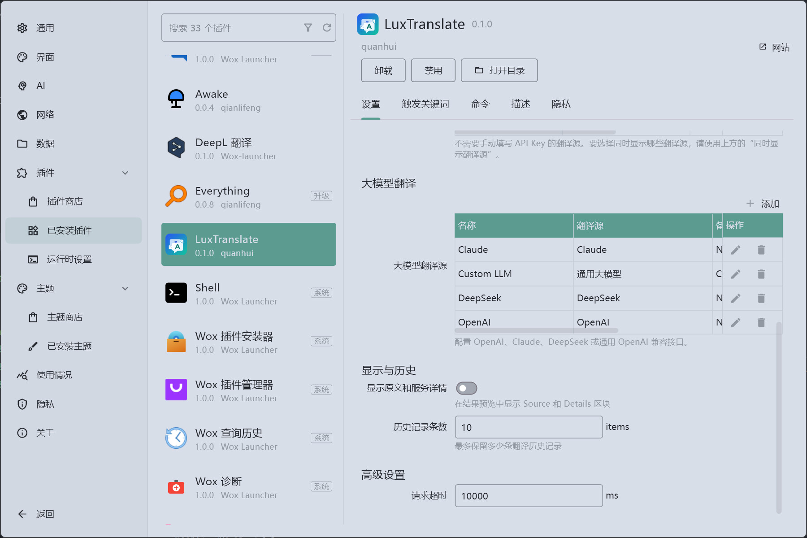
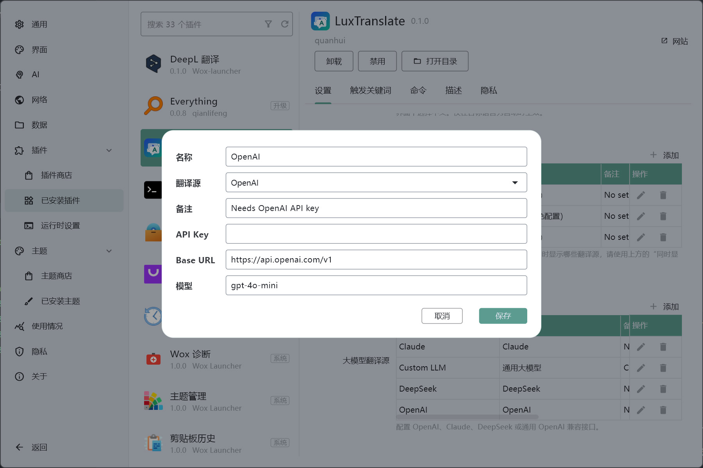
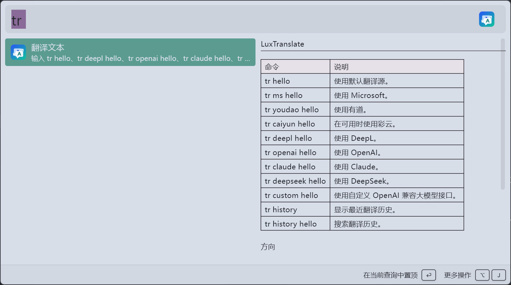
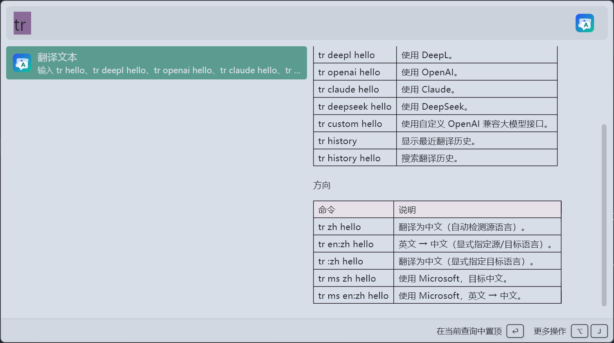
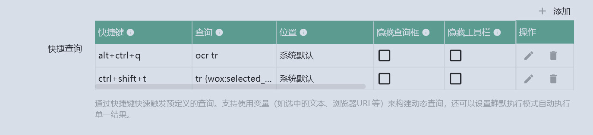

# LuxTranslate

LuxTranslate 是一个面向 [Wox](https://github.com/Wox-launcher/Wox) 的翻译插件。它提供 `tr` 触发词，默认自动判断中英文方向：检测到中文时翻译为英文，其他文本默认翻译为中文。

## 功能

- 默认 `tr <text>` 快速翻译，回车复制译文。
- 支持中文/英文方向的轻量自动识别。
- 支持多翻译源同时展示结果。
- 支持翻译历史缓存，避免重复请求 API。
- 支持隐藏或显示结果预览里的原文、翻译源和方向详情。
- 设置页按翻译源类型分组，API Key、Base URL 和模型可在表格行编辑中配置。

## 翻译源

LuxTranslate 将翻译源分为三类：

| 类型       | 翻译源                                                |
| ---------- | ----------------------------------------------------- |
| 免配置翻译 | Microsoft、有道、彩云                                 |
| 专用 API   | DeepL                                                 |
| 大模型翻译 | OpenAI、Claude、DeepSeek、通用 OpenAI-compatible 接口 |

说明：

- Microsoft 使用免手动配置的接口，但该接口不是官方稳定 API，可能随时失效。
- 有道使用公开词典/翻译接口，适合轻量查询。
- 彩云使用公开 API 接口，内置测试 Token，适合轻量查询。如需稳定使用建议申请自己的 API Token。
- DeepL 使用官方 DeepL API，需要用户 API Key。
- OpenAI、DeepSeek 和通用大模型使用 OpenAI-compatible chat completions 格式。
- Claude 使用 Anthropic Messages API 格式。

## 安装

当前优先提供 GitHub 源码发布。Wox Store 发布会在后续准备。

```bash
git clone https://github.com/stmluyuer/LuxTranslate.git
cd LuxTranslate
pnpm install
pnpm build
```

构建产物会生成在 `dist/`，可按 Wox 插件开发流程安装或打包。

## 使用

| 命令                | 说明                   |
| ------------------- | ---------------------- |
| `tr hello`          | 使用默认翻译源         |
| `tr 你好`           | 自动翻译为英文         |
| `tr ms hello`       | 强制使用 Microsoft     |
| `tr youdao hello`   | 强制使用有道           |
| `tr caiyun hello`   | 强制使用彩云           |
| `tr deepl hello`    | 强制使用 DeepL         |
| `tr openai hello`   | 强制使用 OpenAI        |
| `tr claude hello`   | 强制使用 Claude        |
| `tr deepseek hello` | 强制使用 DeepSeek      |
| `tr custom hello`   | 强制使用通用大模型接口 |
| `tr history`        | 查看最近翻译历史       |
| `tr history hello`  | 搜索翻译历史           |

### 使用小技巧

可以配合 Wox 自带的“快捷查询”功能，把常用快捷键绑定到 `tr {wox:selected_text}`。这样在任意应用中选中文字后，按下快捷键就能直接调用 LuxTranslate 翻译选中文本。

## 配置

- `默认翻译源`：普通 `tr <text>` 使用的翻译源。
- `同时显示翻译源`：选择多个翻译源后，同一次查询会展示多条结果。
- `免配置翻译源`：管理 Microsoft、有道、彩云等无需手动 API Key 的翻译源。
- `大模型翻译源`：配置 OpenAI、Claude、DeepSeek 或通用大模型的 API Key、Base URL 和模型名。
- `历史记录条数`：默认保留 10 条翻译历史。
- `显示原文和服务详情`：控制预览中是否展示原文、provider 和语言方向。

## 开发

```bash
pnpm install
pnpm test
pnpm build
```

常用脚本：

- `pnpm test`：运行 Jest 测试。
- `pnpm build`：运行 lint、format、打包到 `dist/`。
- `pnpm run lint`：运行 ESLint。

## 截图

















## AI 协作声明

本项目由作者在 OpenAI Codex 5.5 协助下大量生成、重构和测试。作者负责需求设计、代码审阅、功能验证和发布决策。

## License

MIT License. See [LICENSE](LICENSE).

---

# LuxTranslate

LuxTranslate is a translation plugin for [Wox](https://github.com/Wox-launcher/Wox). It uses the `tr` trigger keyword and detects the default direction automatically: Chinese text is translated to English, while other text is translated to Chinese by default.

## Features

- Quick translation with `tr <text>` and Enter-to-copy result actions.
- Lightweight Chinese/English direction detection.
- Multiple providers displayed in the same query.
- Translation history cache to avoid repeated API calls.
- Optional preview details for source text, provider, and language direction.
- Provider settings grouped by category, with API keys, base URLs, and models configured from editable table rows.

## Providers

LuxTranslate groups providers into three categories:

| Category              | Providers                                                   |
| --------------------- | ----------------------------------------------------------- |
| No-setup translation  | Microsoft, Youdao, Caiyun                                   |
| Dedicated API         | DeepL                                                       |
| Large language models | OpenAI, Claude, DeepSeek, custom OpenAI-compatible endpoint |

Notes:

- Microsoft uses the same no-setup signed translator endpoint pattern used by LunaTranslator. It is not an official Azure Translator API contract and may change.
- Youdao uses the signed desktop dictionary translation endpoint for lightweight lookups.
- Caiyun uses the web translator JWT flow used by LunaTranslator for lightweight lookups.
- OpenAI, DeepSeek, and custom LLM providers use the OpenAI-compatible chat completions format.
- Claude uses the Anthropic Messages API format.
- DeepL uses the official DeepL API and requires a user API key.

## Installation

The repository is prepared for Wox Store packaging. Publish a GitHub release with the generated `.wox` asset before submitting the store entry.

```bash
git clone https://github.com/stmluyuer/LuxTranslate.git
cd LuxTranslate
pnpm install
pnpm build
make package
```

The build output is written to `dist/`. `make package` creates `wox.plugin.luxtranslate.wox` for GitHub Releases and Wox Store download URLs.

## Usage

| Command             | Description                        |
| ------------------- | ---------------------------------- |
| `tr hello`          | Use the default provider           |
| `tr 你好`           | Translate to English automatically |
| `tr ms hello`       | Force Microsoft                    |
| `tr youdao hello`   | Force Youdao                       |
| `tr caiyun hello`   | Force Caiyun                       |
| `tr deepl hello`    | Force DeepL                        |
| `tr openai hello`   | Force OpenAI                       |
| `tr claude hello`   | Force Claude                       |
| `tr deepseek hello` | Force DeepSeek                     |
| `tr custom hello`   | Force the custom LLM endpoint      |
| `tr history`        | Show recent translation history    |
| `tr history hello`  | Search translation history         |

### Tip

LuxTranslate works well with Wox's built-in quick query feature. Bind a hotkey to `tr {wox:selected_text}` to translate the currently selected text from any app without typing the query manually.

## Configuration

- `Default provider`: provider used by normal `tr <text>` queries.
- `Visible providers`: choose multiple providers to display several results at once.
- `No-setup providers`: manage Microsoft, Youdao, and Caiyun-style providers.
- `Large language model providers`: configure OpenAI-compatible API keys, base URLs, and model names for OpenAI, Claude, DeepSeek, or custom endpoints.
- `History limit`: keeps 10 entries by default.
- `Show source and provider details`: controls whether previews include source text, provider, and direction details.

## Development

```bash
pnpm install
pnpm test
pnpm build
```

Useful scripts:

- `pnpm test`: run Jest tests.
- `pnpm build`: run lint, format, and bundle to `dist/`.
- `pnpm run lint`: run ESLint.

## Screenshots


## AI Assistance Disclosure

This project was substantially generated, refactored, and tested with assistance from OpenAI Codex 5.5. The author was responsible for requirements, code review, validation, and release decisions.

## License

MIT License. See [LICENSE](LICENSE).
